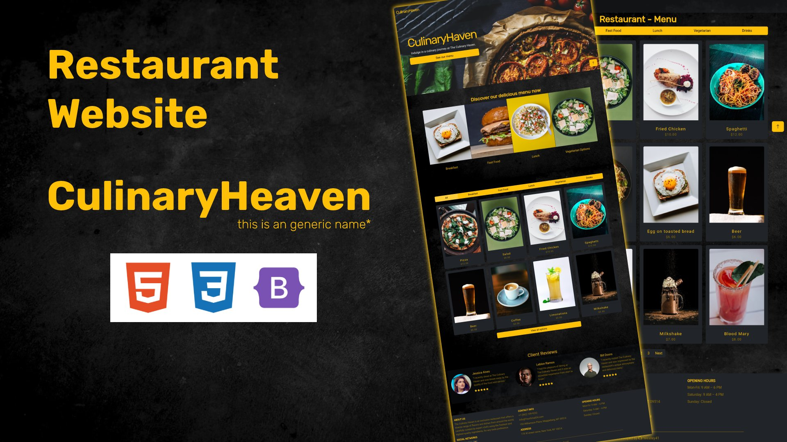

# 1nd test of the discipline "Programação 3" at UESPI

## [Restaurant Landing Page (click here to access)](https://weslley41.github.io/culinary_haven/)

## Students:
- Weslley de Jesus Souza Morais

## Task
Create a static page using `html` + `css` and optionally with `bootstrap`

## Technologies used

    
    
    

